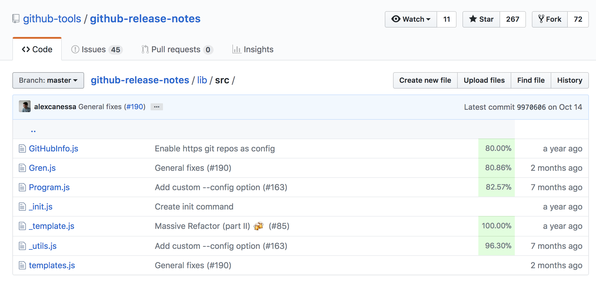
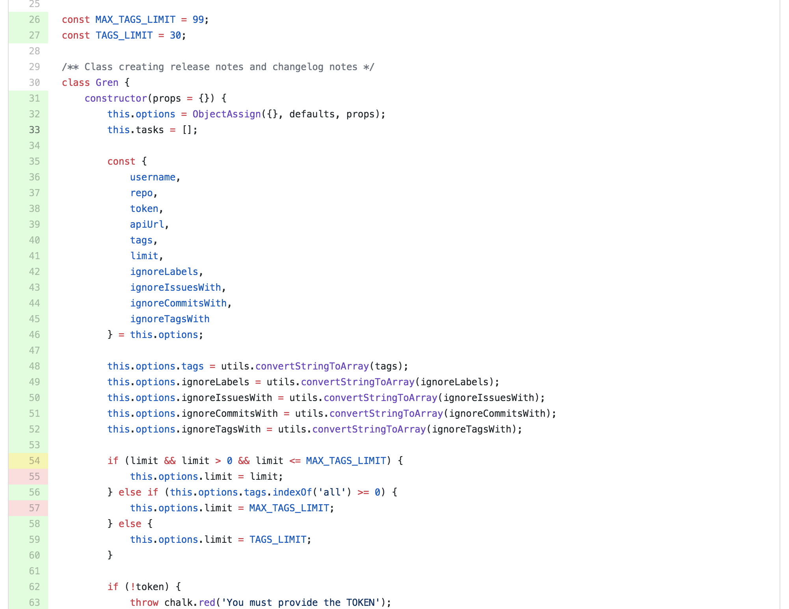
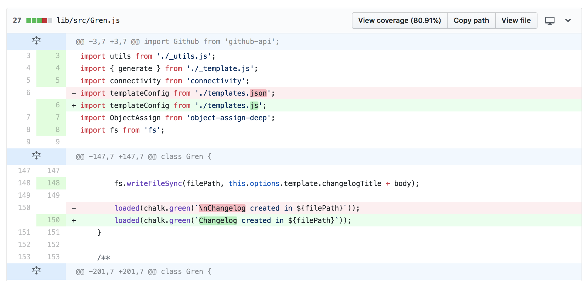
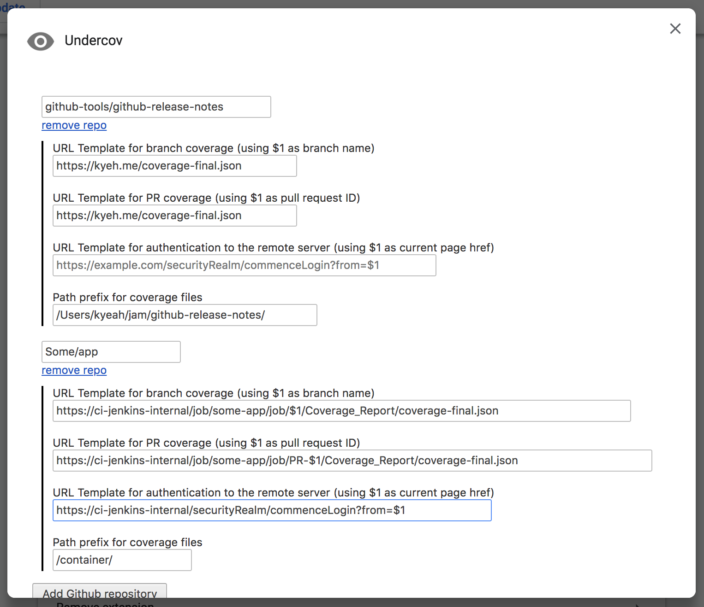

# undercov

A Chrome extension to overlay code coverage reports from arbitrary HTTPS sources onto Github projects. 

This allows individuals and organizations to retrieve and overlay reports from private servers through user-authentication mechanisms, without having to upload files or grant access to third parties.

In the future, reports from available third parties, such as codecov and coveralls, will also be supported.



## Contributing

Please submit any feedback or bug reports as a GitHub issue. Thanks :)

## Features

- View per-file coverage percentages when browsing the filetree

- View line coverage when browsing files



- View line coverage on pull request file diffs



- Configure data sources for coverage files on a per-repo basis



- Auto-authenticate when an auth URL is provided
- Link to full coverage file pages when an HTML report lives at the same domain
- Auto-configure a repository using a root JSON config file

## Data Format Support

The following formats are currently supported:
- [x] Istanbul JSON
- [ ] Coveralls
- [ ] Codecov
- [ ] Cobertura
- [ ] lcov

## Repo Configuration

Each repo must be set up on a per-user basis to retrieve coverage from the appropriate datasource.

### Config Options

- **branchUrlTemplate**: Path to the coverage file for branches (e.g. master) and tags (e.g. v1.2.0).

  ```
  https://ci-jenkins.internal/job/app/job/$1/Coverage_Report/coverage-final.json
  ```
- **prUrlTemplate**: Path to the coverage file for pull requests. 

  ```
  https://ci-jenkins.internal/job/app/job/PR-$1/Coverage_Report/coverage-final.json
  ```
  
- **authUrlTemplate**: Path to redirect to when the chrome user needs to authenticate.

  ```
  https://ci-jenkins.internal/securityRealm/commenceLogin?from=$1
  ```

  NOTE: In the above example, the Jenkins securityRealm page receives the source github page URI through `?from=$1` and redirects back after the user has authenticated.
- **pathPrefix**: Filepath prefix to be ignored for each file, if your reports were generated with absolute paths. 
 
  ```
  /container/
  ```
  
### Semi-auto configuration

To semi-automate this, you can add an `.undercov.json` file to the root of your Github repository. The raw JSON cannot be automatically retrieved in the background because of Github CSRF protections, but any visitors with the chrome extension will see an `Undercov Available` button with a link to the raw JSON file, which will autoconfigure their extension with the given config options.

```json
{
  "branchUrlTemplate": "https://ci-jenkins.internal/job/app/job/$1/Coverage_Report/coverage-final.json",
  "prUrlTemplate": "https://ci-jenkins.internal/job/app/job/PR-$1/Coverage_Report/coverage-final.json",
  "authUrlTemplate": "https://ci-jenkins.internal/securityRealm/commenceLogin?from=$1",
  "pathPrefix": "/container/"
}
```

## Bucket List

- [ ] UI Options (enable line coverage overlay on the fileblob itself, similar to previous extensions)
- [ ] Support for enterprise github
- [ ] trim permissions and use chrome.permissions.request to request user-specified pages
- [ ] travis/circleci integration

## Thanks

* This extension is inspired by the [codecov browser extension](https://github.com/codecov/browser-extension) and the [coveralls-overlay project](https://github.com/kwonoj/coveralls-overlay).
* Icon resource comes from Google's [material design icon library](https://www.google.com/design/icons/#ic_visibility).
